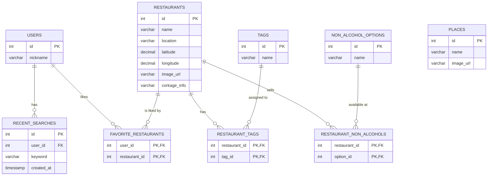

# ERD (Entity Relationship Diagram) 명세서

`API_SPEC.md`를 바탕으로 백엔드 데이터베이스 구축을 위해 작성된 데이터 구조(테이블, 컬럼, 타입, 관계) 명세서입니다.

## 1. 개체 관계도 (Mermaid)

## 2. 테이블 상세 명세

### 1) PLACES (핫플레이스)
앱 메인에 노출되는 추천 지역 정보입니다.
| 컬럼명 | 데이터 타입(Type) | 제약조건 | 설명 |
|---|---|---|---|
| `id` | INT | PK, Auto Increment | 핫플레이스 고유 ID |
| `name` | VARCHAR(50) | NOT NULL | 지역 이름 (예: 강남역) |
| `image_url` | VARCHAR(255) | NOT NULL | 지역 썸네일 이미지 주소 |

### 2) RESTAURANTS (식당 기본 정보)
식당의 핵심 정보를 담습니다. (`distance`, `balanceScore`는 사용자 위치와 필터 비율에 따라 동적으로 계산되어야 하므로, DB에는 위치 계산을 위한 위경도만 저장합니다.)
| 컬럼명 | 데이터 타입(Type) | 제약조건 | 설명 |
|---|---|---|---|
| `id` | INT | PK, Auto Increment | 식당 고유 ID |
| `name` | VARCHAR(100) | NOT NULL | 식당 이름 |
| `location` | VARCHAR(100) | NOT NULL | 동/주소 (예: 성수동1가) |
| `latitude` | DECIMAL(10,8) | NOT NULL | 위도 (거리 계산용) |
| `longitude` | DECIMAL(11,8) | NOT NULL | 경도 (거리 계산용) |
| `image_url` | VARCHAR(255) | | 식당 메인 이미지 주소 |
| `corkage_info`| VARCHAR(255) | | 콜키지 정책 텍스트 (상세 페이지 노출) |

### 3) TAGS & RESTAURANT_TAGS (식당 해시태그)
하나의 식당이 여러 태그를 가질 수 있고, 하나의 태그도 여러 식당에 붙을 수 있는 다대다(N:M) 관계를 해소하는 매핑 테이블 구조입니다.

**TAGS 테이블 (태그 종류)**
| 컬럼명 | 데이터 타입(Type) | 제약조건 | 설명 |
|---|---|---|---|
| `id` | INT | PK, Auto Increment | 태그 고유 ID |
| `name` | VARCHAR(50) | UNIQUE, NOT NULL| 태그명 (예: #논알콜와인) |

**RESTAURANT_TAGS 테이블 (식당-태그 연결)**
| 컬럼명 | 데이터 타입(Type) | 제약조건 | 설명 |
|---|---|---|---|
| `restaurant_id` | INT | PK, FK | RESTAURANTS의 id 참조 |
| `tag_id` | INT | PK, FK | TAGS의 id 참조 |

### 4) NON_ALCOHOL_OPTIONS & RESTAURANT_NON_ALCOHOLS (논알콜 메뉴)
식당 상세 정보에 표시되는 논알콜 메뉴 옵션 관리용 구조입니다.

**NON_ALCOHOL_OPTIONS 테이블 (옵션 종류)**
| 컬럼명 | 데이터 타입(Type) | 제약조건 | 설명 |
|---|---|---|---|
| `id` | INT | PK, Auto Increment | 옵션 고유 ID |
| `name` | VARCHAR(50) | UNIQUE, NOT NULL| 메뉴명 (예: 논알콜 와인) |

**RESTAURANT_NON_ALCOHOLS 테이블 (식당-옵션 연결)**
| 컬럼명 | 데이터 타입(Type) | 제약조건 | 설명 |
|---|---|---|---|
| `restaurant_id` | INT | PK, FK | RESTAURANTS의 id 참조 |
| `option_id` | INT | PK, FK | NON_ALCOHOL_OPTIONS의 id 참조 |

### 5) USERS & RECENT_SEARCHES & FAVORITE_RESTAURANTS (사용자 기능)
최근 검색어와 찜하기(`isFavorite`) 여부를 식별하기 위해서는 사용자를 구분해야 하므로 사용자 및 연관 테이블이 필요합니다.

**USERS 테이블 (사용자)**
| 컬럼명 | 데이터 타입(Type) | 제약조건 | 설명 |
|---|---|---|---|
| `id` | INT | PK, Auto Increment | 유저 고유 ID |
| `nickname` | VARCHAR(50) | | 닉네임 |

**RECENT_SEARCHES 테이블 (최근 검색 기록)**
| 컬럼명 | 데이터 타입(Type) | 제약조건 | 설명 |
|---|---|---|---|
| `id` | INT | PK, Auto Increment | 검색 기록 고유 ID |
| `user_id` | INT | FK | 검색한 유저의 ID |
| `keyword` | VARCHAR(50) | NOT NULL | 검색어 (예: 강남역) |
| `created_at` | TIMESTAMP | DEFAULT NOW() | 검색한 시간 |

**FAVORITE_RESTAURANTS 테이블 (찜한 식당 매핑)**
| 컬럼명 | 데이터 타입(Type) | 제약조건 | 설명 |
|---|---|---|---|
| `user_id` | INT | PK, FK | USERS의 id 참조 |
| `restaurant_id` | INT | PK, FK | RESTAURANTS의 id 참조 |
